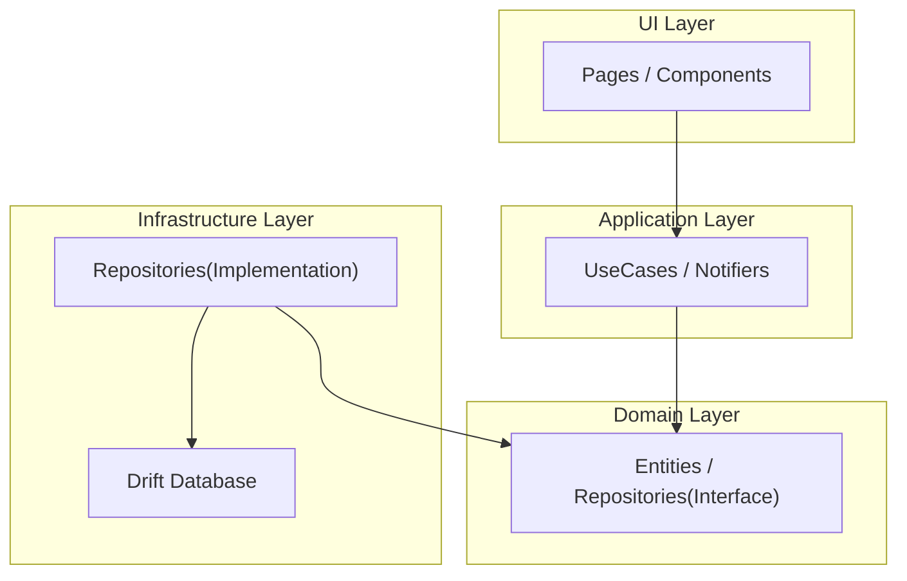

# Clean Architecture TODO

## 概要

このプロジェクトは、Flutterにおけるクリーンアーキテクチャの学習と実践を目的としたTODOアプリケーションです。

アプリケーションの完成度そのものよりも、以下の点を意識して開発しています。

-   **変更容易性とテスト容易性の高い設計**: ドメイン、アプリケーション、インフラストラクチャ、UIの各層を分離したレイヤードアーキテクチャを採用しています。
-   **技術選定への理解**: Riverpodによる状態管理、Driftによるローカルデータベース、Freezedによるイミュータブルなデータモデルなど、モダンなFlutter開発で広く使われている技術スタックへの理解を示します。
-   **開発プロセスへの意識**: `build_runner`によるコード生成の活用や、静的解析ツールによるコード品質の維持など、効率的で堅牢な開発プロセスを意識しています。

## アーキテクチャ

本プロジェクトでは、関心の分離を徹底するためのレイヤードアーキテクチャを採用しています。各レイヤーは決められた方向にのみ依存し、ビジネスロジックの純粋性とUIの独立性を高めています。

### システム構成図



### 各レイヤーの責務

-   **Domain Layer**:
    -   アプリケーションの最も中心的なビジネスロジックを担います。
    -   `Entity`（例: `Task`）や、データ永続化のための抽象インターフェース（`Repository`）を定義します。
    -   このレイヤーは、他のどのレイヤーにも依存せず、フレームワークから独立しています。

-   **Application Layer**:
    -   ドメイン層のロジックを呼び出し、アプリケーション固有のユースケースを実現します。
    -   UIからの入力を受け取り、ドメイン層のオブジェクトを操作してタスクを実行します。
    -   Riverpodの`Notifier`や`UseCase`がこの層に該当します。

-   **Infrastructure Layer**:
    -   ドメイン層で定義されたインターフェースを具体的に実装する層です。
    -   Drift（SQLite）を用いたデータベースアクセス、外部APIとの通信など、技術的な詳細をカプセル化します。

-   **UI Layer**:
    -   ユーザーとのインタラクションを担当します。
    -   アプリケーション層から受け取った状態を画面に描画し、ユーザーの入力をアプリケーション層に伝えます。
    -   FlutterのWidgetがこの層に該当します。

### ディレクトリ構造

MVVM+Repository+Clean Architectureパターンを実装するための具体的なディレクトリ構造は以下の通りです。

-   **Domain層**
    -   `Entity`: ビジネスドメインのデータ構造。`freezed`を用いて定義され、主にUsecaseから使用されます。
    -   `Value`: Entityで使用される値オブジェクト（Enumや定義など）。
    -   `Usecase`: アプリケーションの機能を定義する抽象クラス（インターフェース）。
    -   `Repository`: データ永続化や取得に関する抽象クラス（インターフェース）。
    -   `Service`: 純粋なビジネスロジックや振る舞いを定義します。

-   **Application層**
    -   `Usecase`: Domain層のUsecaseインターフェースの具象実装。`domain/repository`に依存します。
    -   `Provider`: UsecaseをDI（依存性注入）するためのProvider。`infrastructure/repository`の具象実装を注入します。

-   **Infrastructure層**
    -   `Datasource`: データベースやAPIなど、具体的なリソースへのI/Oを実装します。
    -   `Repository`: Domain層のRepositoryインターフェースの具象実装。Datasourceに依存します。
    -   `Model`: Datasourceで使用するデータモデル（DTOなど）。
    -   `Service`: データベースやAPI以外の外部リソースとのI/Oを実装します。
    -   `Provider`: Repository, Datasource, ServiceなどをDIするためのProviderを定義します。

-   **UI層**
    -   `Page`: アプリケーションの各画面に対応するWidget。
    -   `Component`: 画面間で再利用可能なUIパーツ。
    -   `Notifier`: UIの状態を管理するViewModel（StateNotifierなど）。
    -   `State`: PageやComponentで表示するデータの状態を表すクラス。
    -   `Navigator`: 画面遷移やダイアログ表示など、`BuildContext`を扱う処理を実装します。

-   **Core**
    -   `util`: ドメイン知識を含まない便利なユーティリティ関数。
    -   `extension`: 既存クラスの機能を拡張するメソッド。

-   **Constant**: アプリ全体で使用する定数。

### 設計思想と原則

#### ビジネスドメインとビジネスロジック

-   **ビジネスドメイン**: アプリケーションが解決しようとしている問題領域そのものを指します。これは技術的な実装（＝アプリ）から切り離された、ビジネスの純粋な本質です。
-   **ビジネスロジック**: ビジネスドメインにおけるルールや制約の集まりです。このロジックが守られることで、ビジネスとしての一貫性や秩序が保たれます。Domain層は、このビジネスロジックがすべて記述される場所であり、ここを見ればアプリケーションのルールが理解できるように設計されます。

#### Domain層における抽象の役割

Domain層で`Repository`や`Usecase`を抽象クラス（インターフェース）として定義するのには、以下の理由があります。

-   **依存性逆転の原則（DIP）**: 上位レイヤー（Application, Domain）が下位レイヤー（Infrastructure）の実装詳細に依存するのを防ぎます。これにより、インフラ側の変更（例: DBの切り替え）がビジネスロジックに影響を与えなくなります。
-   **ポリモーフィズムの実現**: 同じインターフェースに対して、異なる実装を切り替え可能にします。例えば、`TaskRepository`というインターフェースに対して、「ローカルDB用」と「クラウドDB用」の2つの実装を用意し、実行時に切り替えるといったことが容易になります。
-   **テスト容易性の向上**: 依存するインターフェースを、テスト用のモック（偽の）オブジェクトに簡単に置き換えることができます。これにより、他のレイヤーから独立してビジネスロジックを単体でテストすることが可能になります。

#### レイヤー間の依存関係とデータフロー

各レイヤーで扱うデータモデルは、その責務に応じて明確に分離されます。

1.  **Infrastructure層**: `Datasource`では、データベース（Drift）やAPIクライアントなど、外部ライブラリが提供するモデルを直接扱います。`Repository`の実装は、これらの外部モデルを受け取り、Domain層で定義された`Entity`へと変換する責務を持ちます。
2.  **Domain/Application層**: これらの層では、外部ライリブラリやフレームワーク固有の型は扱わず、Domain層で定義された`Entity`とDartの標準型のみを使用します。これにより、ビジネスロジックの純粋性を保ちます。
3.  **UI層**: `Notifier`（ViewModel）は、Application層のUsecaseから受け取った`Entity`を、画面表示に最適化された`State`オブジェクトに変換します。`State`はUIが必要とする情報だけを持つシンプルなデータクラスであり、そのままWidgetで利用されます。

## 使用技術

-   **Framework**: Flutter
-   **Language**: Dart
-   **State Management**: Riverpod
-   **Immutable Data Models**: Freezed
-   **Local Database**: Drift (SQLite)
-   **Code Generation**: build_runner, riverpod_generator, json_serializable
-   **Linting**: flutter_lints, riverpod_lint

## 必要条件

-   Flutter SDK 3.8.1 以上

## 環境構築

1.  **リポジトリをクローン:**
    ```bash
    git clone https://github.com/your-username/clean_architecture_todo.git
    cd clean_architecture_todo
    ```

2.  **パッケージの依存関係をインストール:**
    ```bash
    flutter pub get
    ```

3.  **コード生成を実行:**
    ```bash
    flutter pub run build_runner build --delete-conflicting-outputs
    ```

## 使用方法

上記の手順で環境構築後、以下のコマンドでアプリケーションを実行します。

```bash
flutter run
```

## 開発の記録

### 1. ミニマムにRAMで実装

#### 目標
とりあえずTODOアプリの要件を満たして動くものを作る

#### 要件
ホームページでTODOを追加することができる。
一覧表示して、編集、削除をすることができる。
なるべくシングルページアプリケーションとする。

#### TODOエンティティ
完了フラグと作成日時、期日、タイトル、詳細、優先度が必要。

### 2. ローカルDBを利用してデータを永続化
ローカルDBでのデータ永続化に加え、タスクの詳細画面への画面遷移を実装します。
タスクをクリックすると詳細画面へ移動し、そこでタスクの更新や削除ができるようにします。

同時にテストも行うようにしていく。

### 3. Firebaseを使用して認証とクラウドDBを実装

## 3. Firebaseを使用して認証とクラウドDBを実装