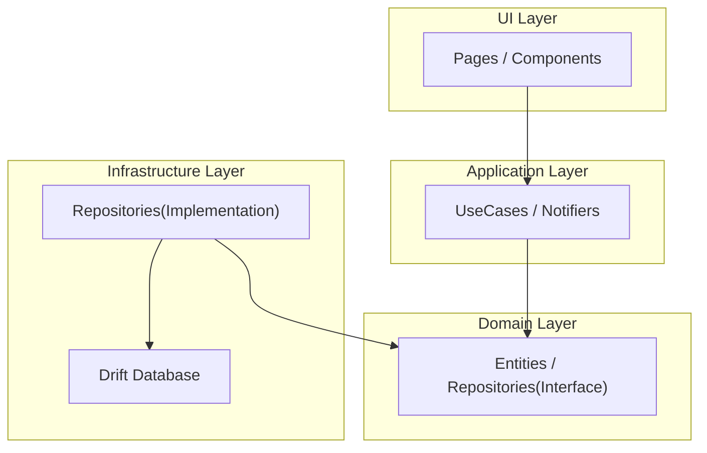

# Clean Architecture TODO

## 概要

このプロジェクトは、Flutterにおけるクリーンアーキテクチャの学習と実践を目的としたTODOアプリケーションです。

アプリケーションの完成度そのものよりも、以下の点を意識して開発しています。

-   **変更容易性とテスト容易性の高い設計**: ドメイン、アプリケーション、インフラストラクチャ、UIの各層を分離したレイヤードアーキテクチャを採用しています。
-   **技術選定への理解**: Riverpodによる状態管理、Driftによるローカルデータベース、Freezedによるイミュータブルなデータモデルなど、モダンなFlutter開発で広く使われている技術スタックへの理解を示します。
-   **開発プロセスへの意識**: `build_runner`によるコード生成の活用や、静的解析ツールによるコード品質の維持など、効率的で堅牢な開発プロセスを意識しています。

## アーキテクチャ

本プロジェクトでは、関心の分離を徹底するためのレイヤードアーキテクチャを採用しています。各レイヤーは決められた方向にのみ依存し、ビジネスロジックの純粋性とUIの独立性を高めています。

### システム構成図



### 各レイヤーの責務

-   **Domain Layer**:
    -   アプリケーションの最も中心的なビジネスロジックを担います。
    -   `Entity`（例: `Task`）や、データ永続化のための抽象インターフェース（`Repository`）を定義します。
    -   このレイヤーは、他のどのレイヤーにも依存せず、フレームワークから独立しています。

-   **Application Layer**:
    -   ドメイン層のロジックを呼び出し、アプリケーション固有のユースケースを実現します。
    -   UIからの入力を受け取り、ドメイン層のオブジェクトを操作してタスクを実行します。
    -   Riverpodの`Notifier`や`UseCase`がこの層に該当します。

-   **Infrastructure Layer**:
    -   ドメイン層で定義されたインターフェースを具体的に実装する層です。
    -   Drift（SQLite）を用いたデータベースアクセス、外部APIとの通信など、技術的な詳細をカプセル化します。

-   **UI Layer**:
    -   ユーザーとのインタラクションを担当します。
    -   アプリケーション層から受け取った状態を画面に描画し、ユーザーの入力をアプリケーション層に伝えます。
    -   FlutterのWidgetがこの層に該当します。

## 使用技術

-   **Framework**: Flutter
-   **Language**: Dart
-   **State Management**: Riverpod
-   **Immutable Data Models**: Freezed
-   **Local Database**: Drift (SQLite)
-   **Code Generation**: build_runner, riverpod_generator, json_serializable
-   **Linting**: flutter_lints, riverpod_lint

## 必要条件

-   Flutter SDK 3.8.1 以上

## 環境構築

1.  **リポジトリをクローン:**
    ```bash
    git clone https://github.com/your-username/clean_architecture_todo.git
    cd clean_architecture_todo
    ```

2.  **パッケージの依存関係をインストール:**
    ```bash
    flutter pub get
    ```

3.  **コード生成を実行:**
    ```bash
    flutter pub run build_runner build --delete-conflicting-outputs
    ```

## 使用方法

上記の手順で環境構築後、以下のコマンドでアプリケーションを実行します。

```bash
flutter run
```

## 開発の記録

### 1. ミニマムにRAMで実装

#### 目標
とりあえずTODOアプリの要件を満たして動くものを作る

#### 要件
ホームページでTODOを追加することができる。
一覧表示して、編集、削除をすることができる。
なるべくシングルページアプリケーションとする。

#### TODOエンティティ
完了フラグと作成日時、期日、タイトル、詳細、優先度が必要。

### 2. ローカルDBを利用してデータを永続化
ローカルDBでのデータ永続化に加え、タスクの詳細画面への画面遷移を実装します。
タスクをクリックすると詳細画面へ移動し、そこでタスクの更新や削除ができるようにします。

同時にテストも行うようにしていく。

### 3. Firebaseを使用して認証とクラウドDBを実装

## 3. Firebaseを使用して認証とクラウドDBを実装